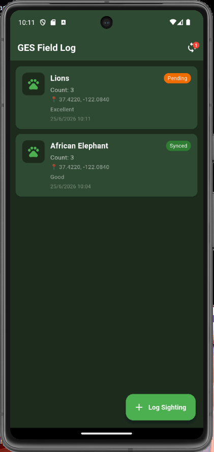
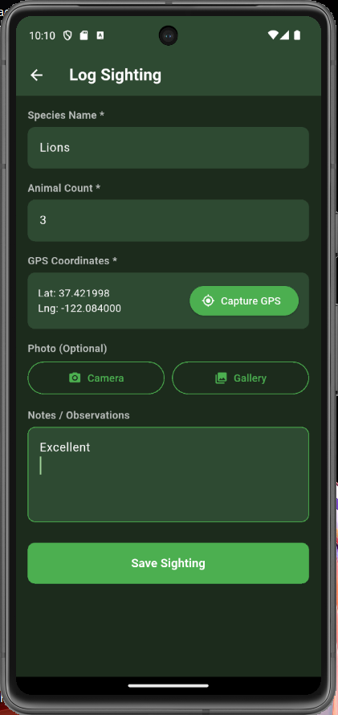
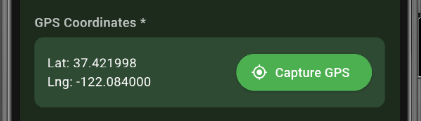
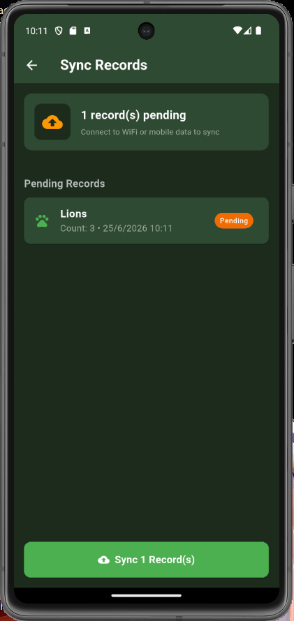
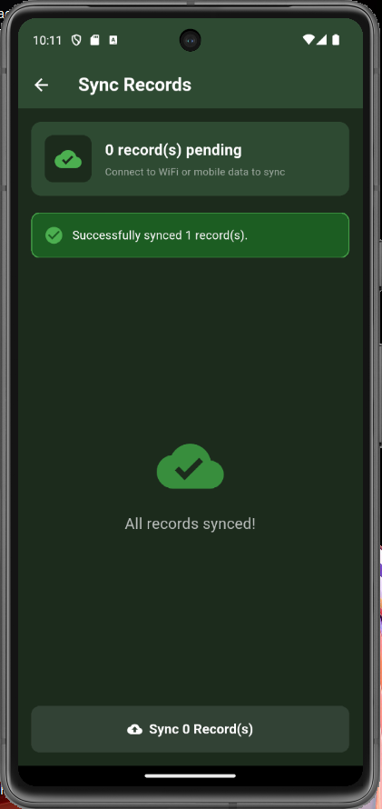
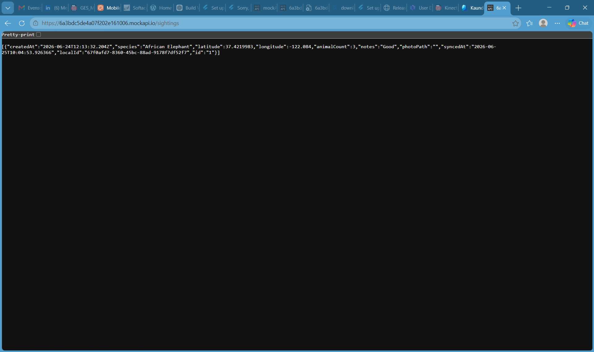

# 🌿 GES Field Log
### Wildlife Ranger Sighting Logger — Mobile Application Developer Practical Assessment
**Green Enterprise Solutions | June 2026**

---

## 📱 Overview

GES Field Log is an **offline-first mobile application** built for wildlife rangers conducting field surveys in areas with unreliable or no internet connectivity. Rangers can log animal sightings throughout the day and sync all pending records to a remote API when a connection becomes available.

---

## 📸 Screenshots

| Home Screen | Log Sighting | GPS Capture |
|---|---|---|
|  |  |  |

| Sync Pending | Sync Success | MockAPI Data |
|---|---|---|
|  |  |  |

---

## ✅ Features

| Feature | Description |
|---|---|
| 🐘 **Log Sightings** | Record species name, animal count, GPS coordinates, photos, and notes |
| 📍 **GPS Capture** | Live coordinates captured via device GPS with permission handling |
| 📷 **Photo Capture** | Take photos with camera or pick from gallery |
| 💾 **Offline Storage** | All sightings stored locally using SQLite — no internet required |
| 🔄 **End-of-Shift Sync** | Sync all pending records to remote API when connection is available |
| ✅ **Sync Status Tracking** | Each sighting shows Synced / Pending badge |
| 🔴 **Pending Badge** | App bar shows count of unsynced records at a glance |

---

## 🏗️ Architecture

```
ges_field_log/
├── lib/
│   ├── main.dart                   # App entry point
│   ├── models/
│   │   └── sighting.dart           # Sighting data model
│   ├── database/
│   │   └── database_helper.dart    # SQLite CRUD operations
│   ├── services/
│   │   └── sync_service.dart       # Connectivity check + API sync
│   └── screens/
│       ├── home_screen.dart        # Sightings list
│       ├── add_sighting_screen.dart # Log new sighting (GPS + Camera)
│       └── sync_screen.dart        # Sync status and trigger
```

---

## 🛠️ Technology Stack

| Layer | Technology |
|---|---|
| Framework | Flutter 3.44.3 (Dart) |
| Local Database | SQLite via `sqflite` |
| GPS | `geolocator` |
| Camera | `image_picker` |
| HTTP Client | `dio` |
| Connectivity | `connectivity_plus` |
| Unique IDs | `uuid` |
| Mock API | MockAPI.io |

---

## 🔄 Offline-First Data Flow

```
Ranger logs sighting
        │
        ▼
  Save to SQLite (isSynced = 0)
        │
        ▼
  App works fully offline
        │
        ▼
  End of shift — internet available
        │
        ▼
  Sync screen → POST each record to API
        │
        ▼
  Mark as synced (isSynced = 1)
        │
        ▼
  Record visible on MockAPI dashboard
```

---

## 🌐 Mock API

**Endpoint:** `https://6a3bdc5de4a07f202e161006.mockapi.io/sightings`

**POST payload example:**
```json
{
  "species": "African Elephant",
  "latitude": -22.5597,
  "longitude": 17.0832,
  "animalCount": 3,
  "notes": "Herd moving towards waterhole, calm behaviour",
  "photoPath": "",
  "syncedAt": "2026-06-25T10:04:53.926Z",
  "localId": "67f0afd7-8360-45bc-88ad-9178f7df52f7"
}
```

---

## 🚀 Getting Started

### Prerequisites
- Flutter SDK 3.44.3+
- Android Studio (for emulator)
- Android SDK API 34+

### Installation

```bash
# Clone the repository
git clone https://github.com/Mikelll7/ges-field-log.git
cd ges-field-log

# Install dependencies
flutter pub get

# Run on Android emulator
flutter run -d emulator-5554
```

---

## 🔒 Android Permissions

```xml
<uses-permission android:name="android.permission.INTERNET"/>
<uses-permission android:name="android.permission.ACCESS_FINE_LOCATION"/>
<uses-permission android:name="android.permission.ACCESS_COARSE_LOCATION"/>
<uses-permission android:name="android.permission.CAMERA"/>
<uses-permission android:name="android.permission.READ_EXTERNAL_STORAGE"/>
<uses-permission android:name="android.permission.WRITE_EXTERNAL_STORAGE"/>
```

---

## 👨‍💻 Developer

**Mikka Hango**
Submitted for the Mobile Applications Developer (Mid-Level) practical assessment
Green Enterprise Solutions | June 2026